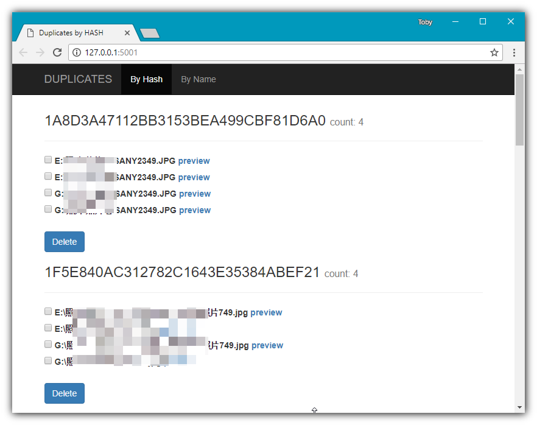
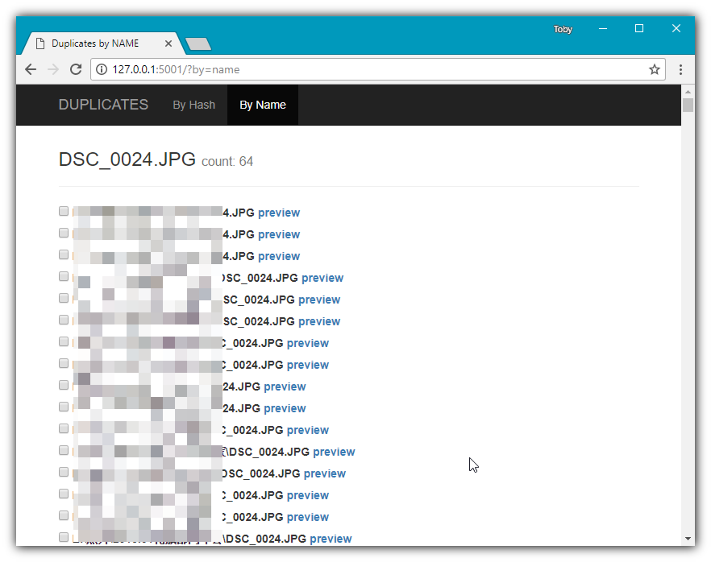

# photodup
Find duplicate photos (or any other file types) on your computer. Python 3.x required.

# Step 0

Setup workspace and install requirements.

```shell
pip install -r requirements.txt
```

# Step 1

Create a database for later scanning.

```shell
python db.py
```

This action will create a `photo.db` in workspace.

# Step 2

Run command to scan all photos from somewhere.

```shell
python scan.py dir1 dir2
```

This action will scan all photo files(*.jpg by default, check `config.py`) into database.

# Step2 

Run command to start a web page to help identify duplicate photos / files.

```
python web.py
```

Launch browser to http://127.0.0.1:5001 to cleanup the duplicates. You will be able to clean up files by hash or file name.



